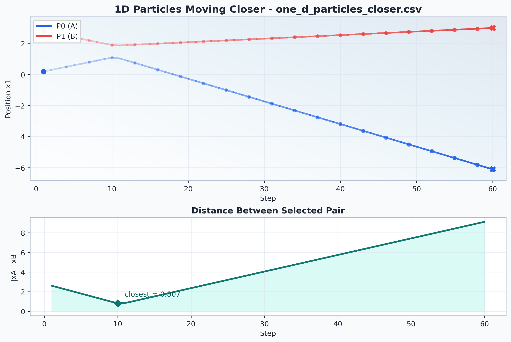
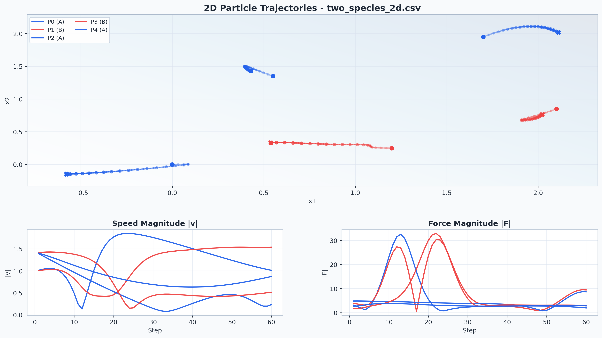
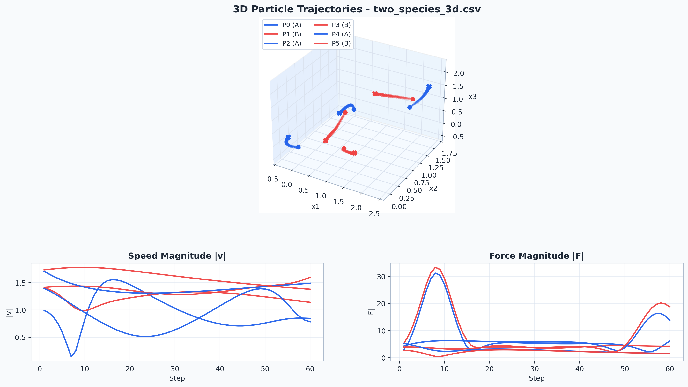

{ width=70% }

\

# Introduction

This report describes my implementation of Assignment II for the CTfS course: a molecular dynamics simulator in Scheme (Guile) using the Lennard-Jones (6-12) interaction model. I designed the code to remain simple to read while still being modular enough to scale from 1D to 2D and 3D. The same shared core is reused across dimensions, and species-specific interaction parameters are supported without changing the integration logic.

The primary goals were:

1. Use a physically meaningful interaction model.
2. Reuse symbolic differentiation work from Assignment I.
3. Show clean dimensional progression from 1D to 3D.
4. Support two species with different mass and pair parameters.
5. Produce reproducible outputs and dedicated tests.

# Physical Model

## Lennard-Jones Pair Potential

For two particles separated by distance $r$, the potential is:

$$
V(r) = 4\epsilon\left[\left(\frac{\sigma}{r}\right)^{12} - \left(\frac{\sigma}{r}\right)^6\right]
$$

where:

- $\epsilon$ controls interaction strength,
- $\sigma$ controls characteristic separation,
- $r$ is Euclidean distance.

The force magnitude follows:

$$
F(r) = -\frac{dV}{dr}
$$

In my implementation, this derivative is generated symbolically using Assignment I functions (`deriv` and `simplify`) and then evaluated numerically during simulation.

# Numerical Method

## Integration Scheme

I use Verlet-style position update:

$$
r(t+\Delta t) = 2r(t) - r(t-\Delta t) + a(t)\Delta t^2
$$

Velocity is estimated through centered finite difference:

$$
v(t) = \frac{r(t+\Delta t) - r(t-\Delta t)}{2\Delta t}
$$

This keeps the update logic concise and stable enough for this assignment scale.

# Implementation Architecture

The code is intentionally split into clean layers.

## A. Symbolic Math Layer

- File: `src/model_physis.scm`
- Defines symbolic LJ expression and symbolic force generation.

## B. Model Definition Layer

- File: `src/model_defination.scm`
- Defines global defaults and species-wise parameters.
- Current defaults:
  - `default-steps = 60`
  - `default-dt = 0.01`

## C. Vector Physics Layer

- File: `src/model_physis.scm`
- Handles vector math, pair-force construction, and net-force accumulation.
- Dimension independent by design.

## D. Simulation Orchestration Layer

- File: `src/main.scm`
- Handles particle records, stepping, logging, and CSV writing.
- Main wrappers:
  - `run-1d`
  - `run-1d-approach`
  - `run-2d`
  - `run-3d`

# Multi-Species Setup

Two species are active in this version.

- Mass values:
  - A: 1.0
  - B: 2.0

- Pair parameters $(\epsilon, \sigma)$:
  - (A, A): (1.0, 1.0)
  - (A, B): (1.2, 1.05)
  - (B, B): (0.8, 0.95)

The pair lookup is symmetric, so (A, B) and (B, A) are treated consistently.

# Dimensional Progression

I developed and tested in this order:

1. 1D baseline behavior.
2. 1D approach-focused case to track pair convergence.
3. 2D multi-particle trajectories.
4. 3D multi-particle trajectories.

Current sample sizes:

- 1D standard: 5 particles
- 1D approach: 2 particles
- 2D: 5 particles
- 3D: 6 particles

# Output Design

CSV output format is dimension-aware:

`step, particle, species, x1..xD, v1..vD, f1..fD, a1..aD`

Examples:

- 1D: `x1, v1, f1, a1`
- 2D: `x1, x2, v1, v2, f1, f2, a1, a2`
- 3D: `x1, x2, x3, ...`

# Validation and Testing

Dedicated checks in `tests.scm` validate:

1. Force sanity (repulsion at short range, attraction at longer range).
2. Parameter symmetry across species order.
3. Correct behavior of 1D, 2D, and 3D wrappers.
4. 1D approach behavior (distance reduces at some step).
5. CSV creation and dimensional header correctness.

Latest validated result:

- Tests run: 18
- Passed: 18
- Failed: 0

# Visualization Outputs

Representative figures from generated outputs:







The 2D and 3D plots include gradient path styling and visited-position markers. The 1D specialized panel clearly highlights the closest-separation point in time.

# Complexity, Bottlenecks, and Critiques

## Time Complexity

The dominant cost per step is the all-pairs interaction loop:

$$
O(N^2 \cdot D)
$$

where $N$ is particle count and $D$ is dimension.

## What Works Well

- The shared core avoids code duplication across dimensions.
- Species extension is table-driven.
- Logs and CSV outputs make debugging straightforward.

## Critiques and Limitations (Honest View)

1. **Pairwise scaling is expensive**:
   The current implementation evaluates every directed pair at every step. This is simple and correct, but it will become slow for larger systems.

2. **No boundary conditions yet**:
   I intentionally kept the first version open-domain for clarity. In realistic MD setups, periodic boundaries are often essential.

3. **No explicit energy conservation report**:
   The simulation tracks position, velocity, force, and acceleration, but does not yet include a dedicated total-energy diagnostic panel.

4. **No cutoff or neighbor list optimization**:
   All interactions are fully evaluated. This is good for transparency, not for performance.

5. **Model scope is academically focused**:
   This version is intended to show method and structure clearly for grading, rather than to be a production MD package.

# Conceptual Answers (Humanized)

## 1. What changes are needed for richer multi-species systems?

In this design, most of that work is already done. Each particle carries a species label, and the force lookup already depends on species pairs. So, to support more species, I mostly need to expand two tables: one for mass and one for pair parameters. The integration loop itself does not need to change.

## 2. What changes are needed for different potentials?

The clean part of this architecture is that potential logic is isolated. If I want to move from Lennard-Jones to another potential, I can replace the symbolic potential expression and regenerate the symbolic force. The stepping and state-update pipeline can remain untouched.

## 3. How is Assignment I reused here?

Assignment I is reused directly, not just conceptually. I load `deriv` and `simplify`, define LJ symbolically, generate force symbolically, and then evaluate it numerically during simulation. So the previous assignment is effectively acting as a force-expression generator.

## 4. Process view vs analytical view

This project strongly reflects a process view. Instead of trying to write one closed-form expression for the full motion, I advance the state step by step using local rules. That is exactly why the simulation is intuitive to inspect and debug: each time-step has clear cause-and-effect.

# Conclusion

The final implementation satisfies the assignment requirements with a readable and extensible structure. It demonstrates symbolic-to-numeric reuse, multi-dimensional progression, multi-species support, and reproducible outputs with complete test pass.

At the same time, this report acknowledges clear areas for improvement: performance scaling, boundary handling, and deeper diagnostics. In that sense, the project is both complete as an assignment submission and open for future extension.

# Appendix: Reproduction Commands

## Run tests

```bash
cd assign-02
guile -l tests.scm
```

## Generate CSV outputs

```bash
cd assign-02/src
guile
(load "main.scm")
(run-1d-approach-to-file 60 0.01 "../output/one_d_particles_closer.csv")
(run-2d-to-file 60 0.01 "../output/two_species_2d.csv")
(run-3d-to-file 60 0.01 "../output/two_species_3d.csv")
```

## Generate plots and GIFs

```bash
cd assign-02
python3 plot_md_gestalt.py \
  --input output/one_d_particles_closer.csv output/two_species_2d.csv output/two_species_3d.csv \
  --outdir plots --simulate --sim-outdir plots --fps 12 --trail-length 24
```

## Convert to PDF

```bash
cd assign-02
pandoc report.md -o report.pdf
```